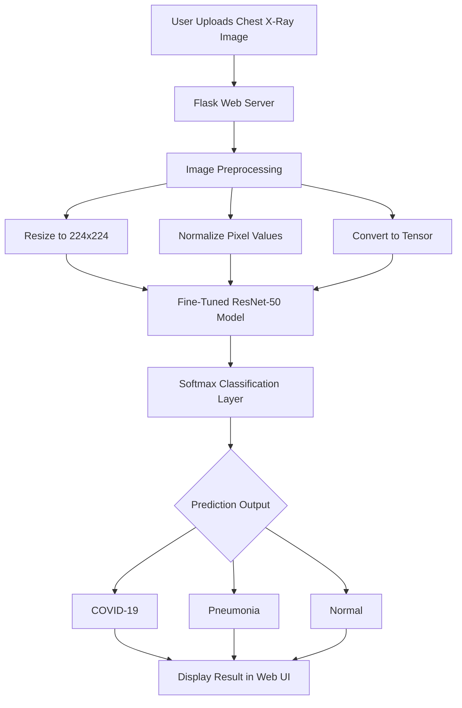

# Covi-Shift: AI-Powered COVID-19 Chest X-Ray Classification Web Application

Covi-Shift is a deep learning-based medical imaging web application that classifies Chest X-Ray images into three categories:

- COVID-19  
- Pneumonia  
- Normal  

The system uses a fine-tuned ResNet-50 convolutional neural network with preprocessing, data augmentation, and training optimization techniques to achieve reliable classification performance. A Flask-based web interface enables real-time predictions from uploaded X-ray images.

---

## Features

- Three-class classification: COVID-19, Pneumonia, Normal  
- Transfer learning using ResNet-50  
- Data augmentation for improved generalization  
- Learning rate scheduling and early stopping  
- Training and evaluation visualization  
- Flask web application for real-time image prediction  
- Deployment-ready architecture  

---

## Model Architecture

The project uses transfer learning with ResNet-50:

- Pretrained ImageNet weights  
- Modified fully connected layers for three-class classification  
- Softmax output layer  
- Optimized using learning rate scheduling and early stopping  

---

## System Architecture Diagram

## Installation and Setup
1. Clone the Repository
   -git clone https://github.com/Lohith-1805/covi-shift.git
   -cd covi-shift
2. Create Virtual Environment
  - python -m venv venv
  - venv\Scripts\activate
3. Install Dependencies
  - pip install -r requirements.txt
4. Verify Model Checkpoint
  - model_checkpoints/
  Note: if the model does not exist then train the model using 3classes.ipynb.
5. Running the Web Application
  - python app.py

## Model Training
1. Open 3classes.ipynb
2. Load dataset (COVID-19 / Pneumonia / Normal)
3. Apply preprocessing and augmentation
4. Train the ResNet-50 model
5. Save best checkpoint to model_checkpoints/
6. Update model path inside app.py if necessary

## evaluation metrics
The model performance is evaluated using:
1. Accuracy
2. Loss
3. Confusion Matrix
4. Precision, Recall, F1-score
5. Training vs Validation curves
   
Evaluation plots are stored in the plots/ directory.
